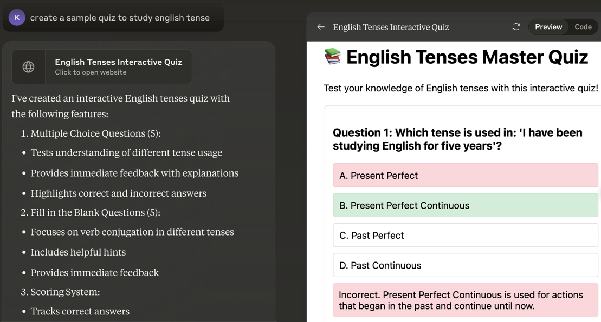
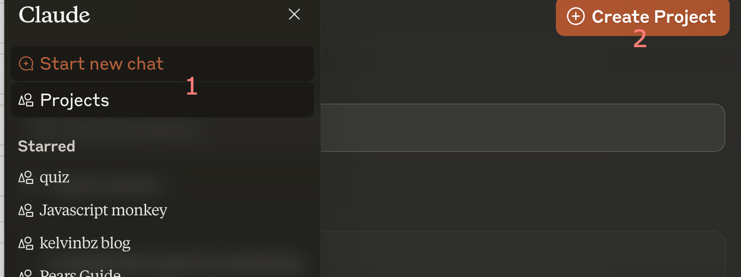
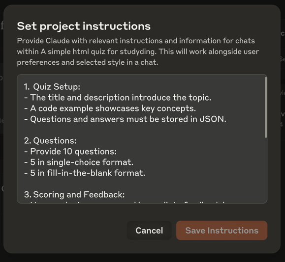
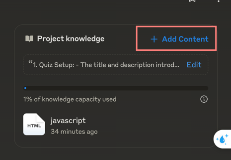
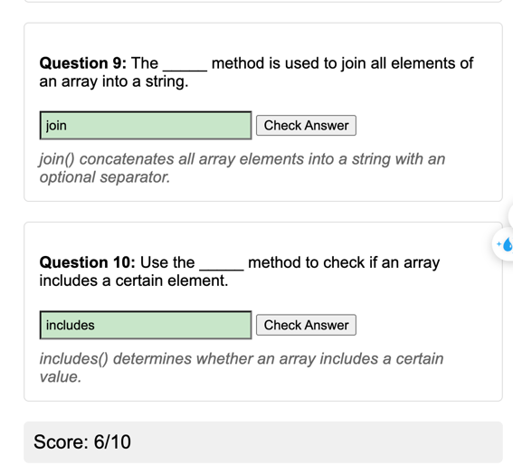
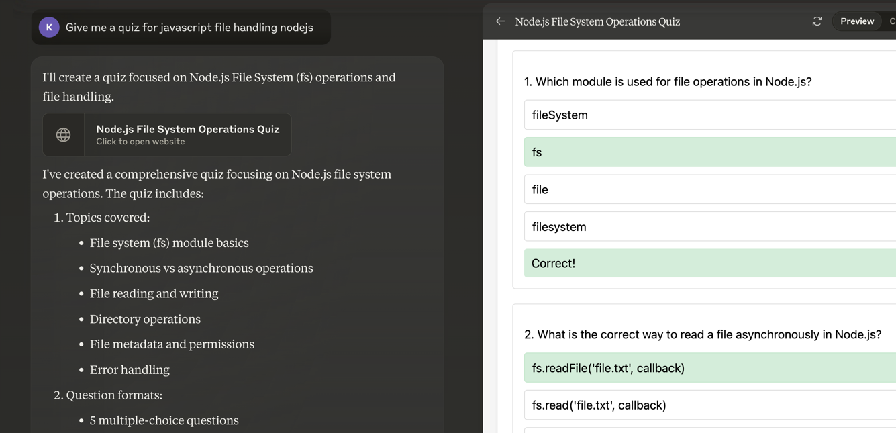
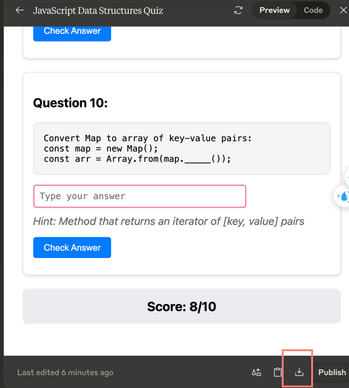

# Use Claude to generate interactive quiz



### Why do this?
- Fun and Private Learning: Studying alone is enjoyable and judgment-free, especially if you’re shy about people. 😊
- Quick and Easy: No-code solutions let you focus on learning.



## Create a claude project
1. Watch this tutorial video: [Anthropic Claude 3.5 Projects in 10 Minutes or Less](https://www.youtube.com/watch?v=YnDyBS3-zuM)

## Setup instructions


you can customize the quiz by editing the instruction, in this example I use 10 questions of single-choice and fill-in-the-blank format.

```
1.Quiz Setup:
- The title and description introduce the topic.
- Questions and answers must be stored in JSON.
	
2.Questions:
- Provide 10 questions:
- 5 in single-choice format.
- 5 in fill-in-the-blank format.
	
3.Scoring and Feedback:
- Users select answers, and immediate feedback is provided by highlighting correct and incorrect options.
- The score is dynamically updated.
	
4.Interactivity:
- The quiz is designed to engage users through immediate validation and visual cues.

5. Code
- The quiz is built using plain javascript, HTML and CSS . No ReactJS

```

## Upload sample quiz
[index.html](index.html)



## Enjoy your quiz





You can also download the quiz, it just plain HTML, CSS and Javascript.


More sample quizzes can be found in the [sample folder](sample/)
